<center><h1>前端报表开发培训--Vue</h1></center>


<center>2019-12-30</center>

<center><h1></h1></center>


### 1.开发框架

#### 1.1 Vue

Vue.js 是构建 Web 界面的 JavaScript 库，提供数据驱动的组件，还有简单灵活的 API，使得 MVVM 更简单。

主要特性：

* 可扩展的数据绑定
* 将普通的 JS 对象作为 model
* 简洁明了的 API
* 组件化 UI 构建
* 配合别的库使用

其他：

[1.Vue中文官网](https://cn.vuejs.org/index.html)

[2.教程](https://cn.vuejs.org/v2/guide/)

[3.对比其他框架](https://cn.vuejs.org/v2/guide/comparison.html)

#### 1.2 ElementUI

Element，一套为开发者、设计师和产品经理准备的基于 Vue 2.0 的组件库，提供了配套设计资源，帮助你的网站快速成型。由饿了么公司前端团队开源。

[官网](https://element.eleme.cn/#/zh-CN)

常用组件：

* 选择器

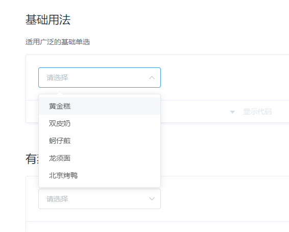

* 日期选择器

  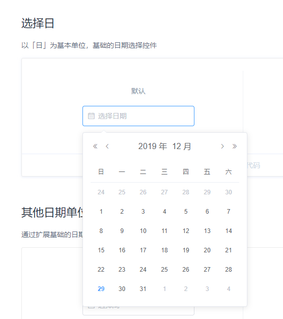

* 表格

  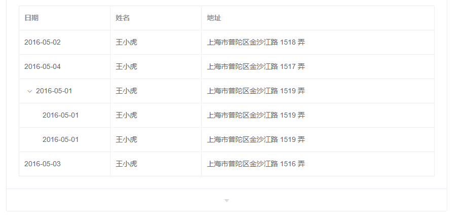

* 对话框

  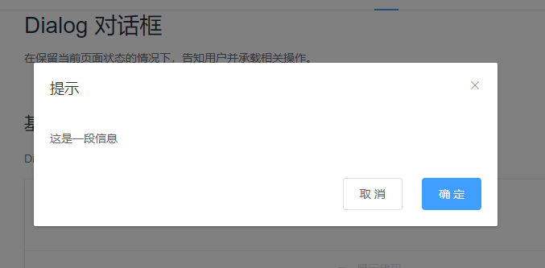

#### 1.3 Echarts

ECharts是一款由百度前端技术部开发的，基于Javascript的数据可视化图表库，提供直观，生动，可交互，可个性化定制的数据可视化图表。

[官方文档]([https://www.echartsjs.com/zh/tutorial.html#5%20%E5%88%86%E9%92%9F%E4%B8%8A%E6%89%8B%20ECharts](https://www.echartsjs.com/zh/tutorial.html#5 分钟上手 ECharts))

#### 1.4 总体结构：

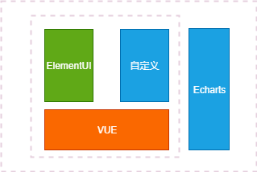

### 2. 环境搭建

#### 2.1 Node.js安装

按照安装包提示安装。

#### 2.1 YARN安装

[官网](https://yarnpkg.com/lang/en/) 按照安装包提示安装，yarn依赖于Node.js。

#### 2.2 Vue安装

通过Vue CLI安装Vue。

```shell
npm install -g @vue/cli
# 或者
yarn global add @vue/cli
```

此处选择yarn的安装方式。安装之后可以通过version检查是否安装成功。

```shell
vue --version
```

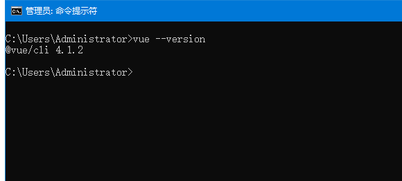

#### 2.3 开发工具

可以选择任意文本编辑工具，此处选择[Visual Studio Code](https://code.visualstudio.com/)。

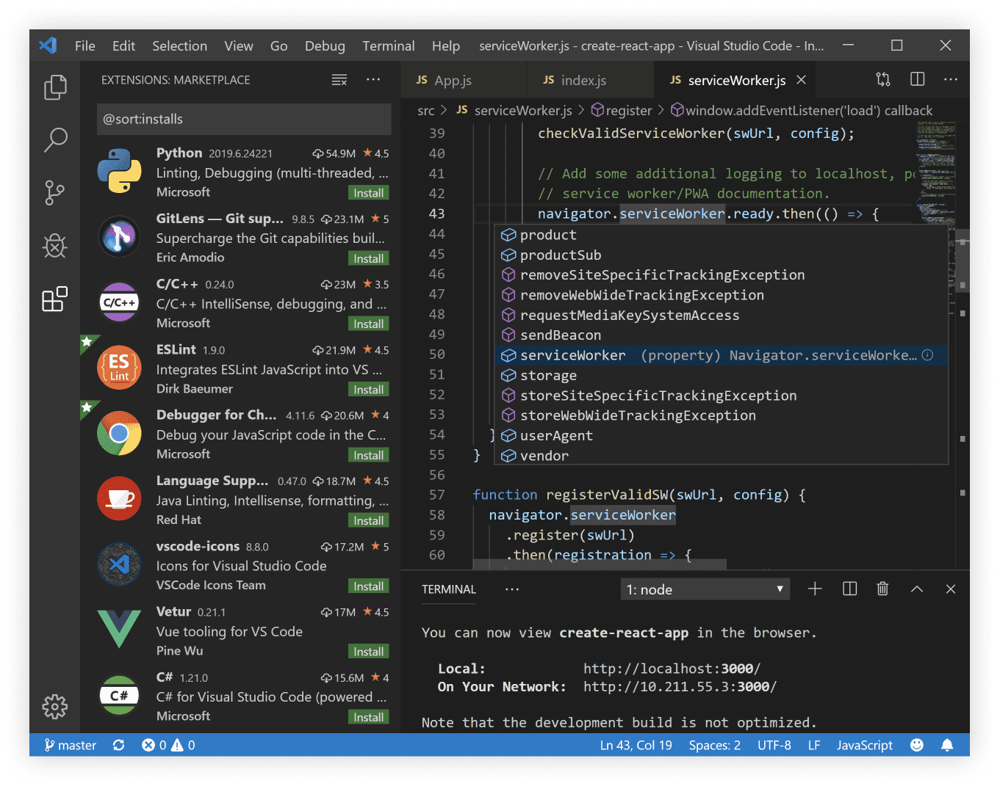

### 3. 工程创建

#### 3.1 通过Vue CLI创建工程

```shell
vue create ireport
```

创建工程：

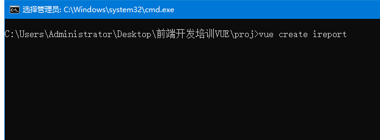

选择默认：

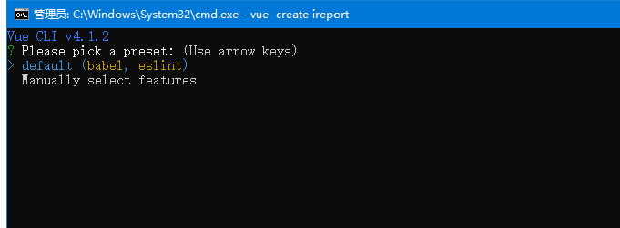

选择Yarn：

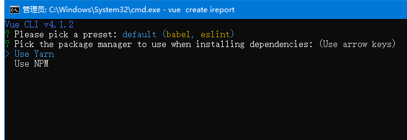

创建完成：

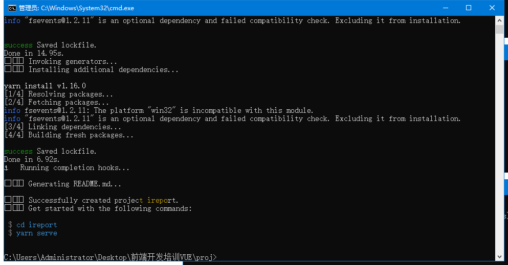

#### 3.2 运行工程

```shell
yarn serve
```

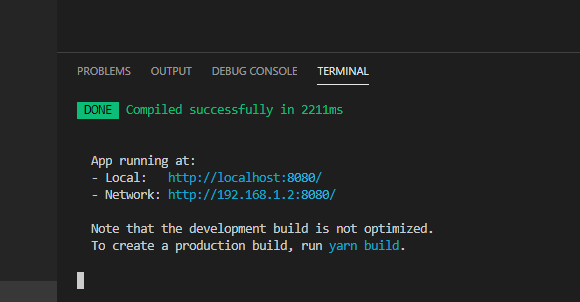

工程运行成功：


#### 3.3 多页面应用

pages，Vue CLI有关于[pages](https://cli.vuejs.org/config/#filenamehashing)的介绍。

```javascript
module.exports = {
  pages: {
    index: {
      // entry for the page
      entry: 'src/index/main.js',
      // the source template
      template: 'public/index.html',
      // output as dist/index.html
      filename: 'index.html',
      // when using title option,
      // template title tag needs to be <title><%= htmlWebpackPlugin.options.title %></title>
      title: 'Index Page',
      // chunks to include on this page, by default includes
      // extracted common chunks and vendor chunks.
      chunks: ['chunk-vendors', 'chunk-common', 'index']
    },
    // when using the entry-only string format,
    // template is inferred to be `public/subpage.html`
    // and falls back to `public/index.html` if not found.
    // Output filename is inferred to be `subpage.html`.
    subpage: 'src/subpage/main.js'
  }
}
```

修改工程目录：

* 修改之前

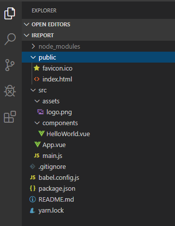

* 修改之后

  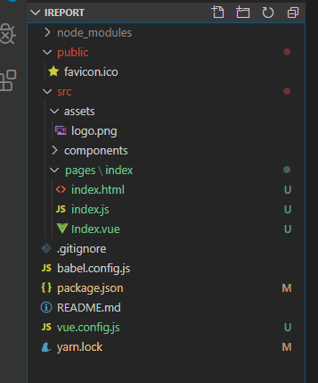

* 修改相对路径Index.vue

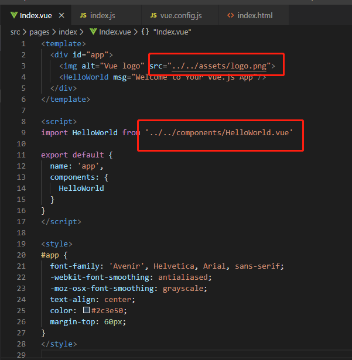

* 修改相对路径index.js

  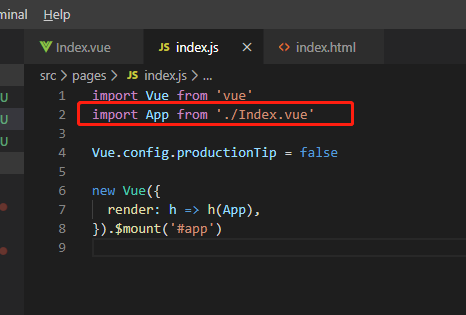

* **根目录添加vue.config.js文件**

  ```javascript
  module.exports = {
      pages: {
          index: {
            entry: './src/pages/index/index.js',
            template: './src/pages/index/index.html',
            filename: 'index.html',
            title: '首页'
          }
      },
      devServer: {
        host: '0.0.0.0',
        port: 9000
      },
      publicPath: process.env.NODE_ENV === 'production' ? '/ireport/dist/': '/'
  }
  
  ```

重启工程查看工程是否正常运行。

##### 3.3.1 【练习】再添加一个页面？


#### 3.4 添加ElementUI

* 添加依赖

```shell
yarn add element-ui
```

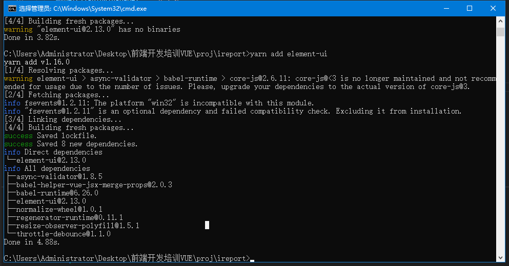

* 代码添加

  参照ElementUI的[快速上手文档](https://element.eleme.cn/#/zh-CN/component/quickstart)在工程代码中添加代码。

  ```vue
  import Vue from 'vue';
  import ElementUI from 'element-ui';
  import 'element-ui/lib/theme-chalk/index.css';
  import App from './App.vue';
  
  Vue.use(ElementUI);
  
  new Vue({
    el: '#app',
    render: h => h(App)
  });
  ```

* 添加ElementUI组件验证是否成功

  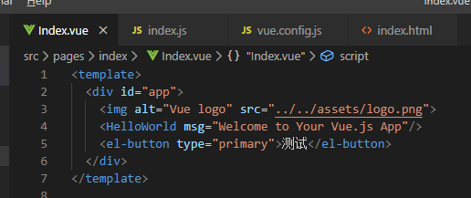

* 正常的执行结果

  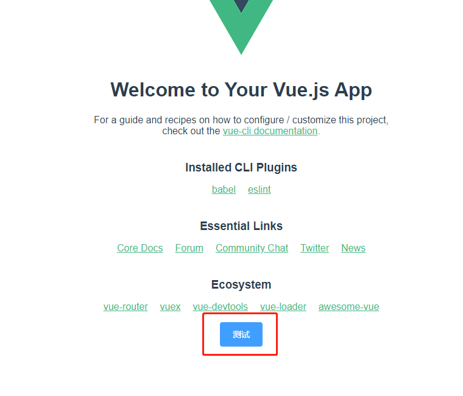

#### 3.5 添加Echarts

* 添加依赖

  ```shell
  yarn add echarts
  ```

  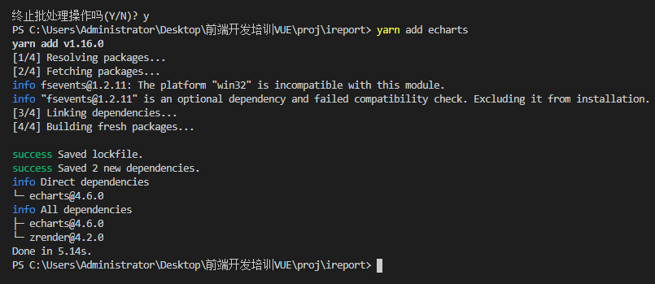

* 修改app.js文件，此处为index.js文件：

  ```javascript
  import Vue from 'vue'
  import ElementUI from 'element-ui';
  import 'element-ui/lib/theme-chalk/index.css';
  import App from './Index.vue'
  import echarts from 'echarts'
  
  Vue.prototype.$echarts = echarts
  
  Vue.config.productionTip = false
  
  Vue.use(ElementUI);
  
  new Vue({
    render: h => h(App),
  }).$mount('#app')
  
  ```

* echarts的添加参考[官方例子]([https://www.echartsjs.com/zh/tutorial.html#5%20%E5%88%86%E9%92%9F%E4%B8%8A%E6%89%8B%20ECharts](https://www.echartsjs.com/zh/tutorial.html#5 分钟上手 ECharts))：

  ```html
  <!DOCTYPE html>
  <html>
  <head>
      <meta charset="utf-8">
      <title>ECharts</title>
      <!-- 引入 echarts.js -->
      <script src="echarts.min.js"></script>
  </head>
  <body>
      <!-- 为ECharts准备一个具备大小（宽高）的Dom -->
      <div id="main" style="width: 600px;height:400px;"></div>
      <script type="text/javascript">
          // 基于准备好的dom，初始化echarts实例
          var myChart = echarts.init(document.getElementById('main'));
  
          // 指定图表的配置项和数据
          var option = {
              title: {
                  text: 'ECharts 入门示例'
              },
              tooltip: {},
              legend: {
                  data:['销量']
              },
              xAxis: {
                  data: ["衬衫","羊毛衫","雪纺衫","裤子","高跟鞋","袜子"]
              },
              yAxis: {},
              series: [{
                  name: '销量',
                  type: 'bar',
                  data: [5, 20, 36, 10, 10, 20]
              }]
          };
  
          // 使用刚指定的配置项和数据显示图表。
          myChart.setOption(option);
      </script>
  </body>
  </html>
  
  ```

### 4. 组件

#### 4.1 简单组件添加

* components文件中添加一个文件CompOne.vue

  ```vue
  <template>
      <div>
          <el-button type="primary">CompOne按钮</el-button>
      </div>
  </template>
  <script>
  export default {
      name: 'CompOne'
  }
  </script>
  ```

* 在Index.vue引用组件：

  ```vue
  <template>
    <div id="app">
      
      <HelloWorld msg="Welcome to Your Vue.js App"/>
      <el-button type="primary">测试</el-button>
      <CompOne />
    </div>
  </template>
  
  <script>
  import HelloWorld from '../../components/HelloWorld.vue'
  import CompOne from '../../components/CompOne.vue'
  
  export default {
    name: 'app',
    components: {
      HelloWorld,
      CompOne
    }
  }
  </script>
  ```

* 检查组件是否安装成功：

  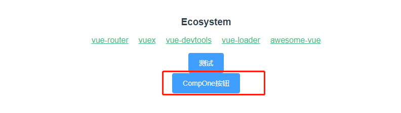

#### 4.2 在component中添加Echarts图表

* 在components文件夹中添加组件SimpleBarChart.vue

  ```vue
  <template>
      <el-card shadow="never">
          <div id="main" ref="refMainChart"></div>
      </el-card>
  </template>
  <script>
  export default {
      name: "SimpleBarChart",
      mounted() {
          this.drawLine()
      },
      methods: {
          drawLine(){
              // 基于准备好的dom，初始化echarts实例
              let myChart = this.$echarts.init(this.$refs.refMainChart)
              myChart.clear()
              // 绘制图表
              let option = {
                  title: {
                      text: 'ECharts 入门示例'
                  },
                  tooltip: {},
                  legend: {
                      data:['销量']
                  },
                  xAxis: {
                      data: ["衬衫","羊毛衫","雪纺衫","裤子","高跟鞋","袜子"]
                  },
                  yAxis: {},
                  series: [{
                      name: '销量',
                      type: 'bar',
                      data: [5, 20, 36, 10, 10, 20]
                  }]
              };
              myChart.setOption(option);
          }
      },
  }
  </script>
  
  <style scoped>
  #main {
      width: 100%;
      height: 300px;
  }
  </style>
  
  ```

* 查看bar图标是否添加成功

  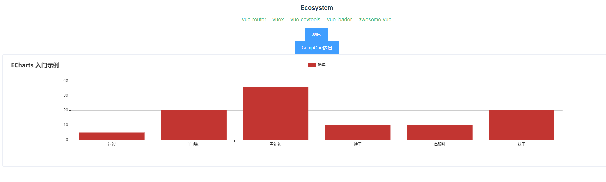

##### 4.2.1 【练习】在页面中添加Echarts图表？

#### 4.3 向子组件中传递数据

通过props的方式向component传递数据。

* 修改SimpleBarChart.vue

  ```vue
  <template>
      <el-card shadow="never">
          <p class="chart-title">{{chartTitle}}</p>
          <div id="main" ref="refMainChart"></div>
      </el-card>
  </template>
  <script>
  export default {
      name: "SimpleBarChart",
      props: ['chartTitle'],
      mounted() {
          this.drawLine()
      },
      // ...
  ```

* 修改Index.vue，向SimpleBarChart.vue传递数据

  ```vue
  <SimpleBarChart chartTitle="Echarts入门"/>
  ```

* 检查属性设置结果

  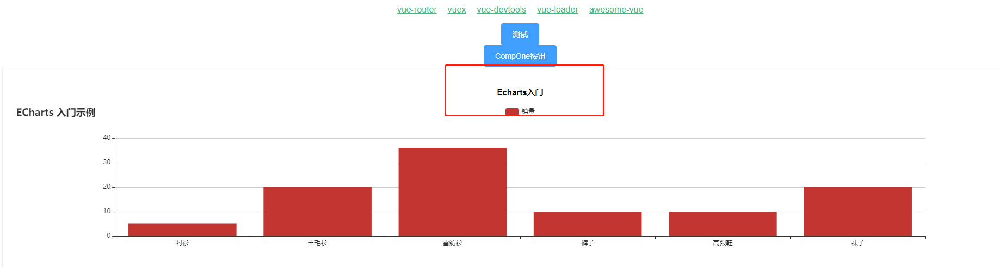

#### 4.4 emit向父级组件传递消息

* 修改CompOne.vue，添加按钮点击事件函数，发出消息

  ```vue
  <template>
      <div>
          <el-button type="primary" @click="onBtnClick">CompOne按钮</el-button>
      </div>
  </template>
  
  <script>
  export default {
      name: 'CompOne',
      methods: {
          onBtnClick() {
              this.$emit('sayHello', '来自CompOne的Hello')
          }
      }
  }
  </script>
  ```

* 修改Index.vue，绑定消息，添加函数，打印参数内容

  ```vue
  <template>
    <div id="app">
      <HelloWorld msg="Welcome to Your Vue.js App"/>
      <el-button type="primary">测试</el-button>
      <CompOne v-on:sayHello="onSayHello"/>
      <SimpleBarChart chartTitle="Echarts入门"/>
    </div>
  </template>
  
  <script>
  import HelloWorld from '../../components/HelloWorld.vue'
  import CompOne from '../../components/CompOne.vue'
  import SimpleBarChart from '../../components/SimpleBarChart.vue'
  
  export default {
    name: 'app',
    components: {
      HelloWorld,
      CompOne,
      SimpleBarChart
    },
    methods: {
      onSayHello(params) {
        console.log(params)
      }
    }
  }
  </script>
  ```

* 查看结果

  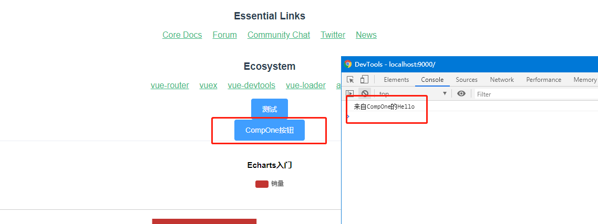

* 解决Unexpected console statement (no-console)报错
  在package.json文件中配置rules

  ```json
      "rules": {
        "no-console":"off"
      }
  ```

#### 4.5 父组件通过refs调用子组件的方法

* 修改CompOne.vue添加方法

  ```vue
  <template>
      <div>
          <el-button type="primary" @click="onBtnClick">CompOne按钮</el-button>
      </div>
  </template>
  
  <script>
  export default {
      name: 'CompOne',
      methods: {
          onBtnClick() {
              this.$emit('sayHello', '来自CompOne的Hello')
          },
          printHello(name) {
              console.log(name, ', Hello again!')
          }
      }
  }
  </script>
  ```

* 修改index.vue，通过refs调用

  ```vue
  <template>
    <div id="app">
      <HelloWorld msg="Welcome to Your Vue.js App"/>
      <el-button type="primary" @click="callCompOneFunc">测试</el-button>
      <CompOne v-on:sayHello="onSayHello" ref="refCompOne"/>
      <SimpleBarChart chartTitle="Echarts入门"/>
    </div>
  </template>
  
  <script>
  import HelloWorld from '../../components/HelloWorld.vue'
  import CompOne from '../../components/CompOne.vue'
  import SimpleBarChart from '../../components/SimpleBarChart.vue'
  
  export default {
    name: 'app',
    components: {
      HelloWorld,
      CompOne,
      SimpleBarChart
    },
    methods: {
      onSayHello(params) {
        console.log(params)
      },
      callCompOneFunc() {
        this.$refs.refCompOne.printHello('李明')
      }
    }
  }
  </script>
  ```

* 查看调用结果

  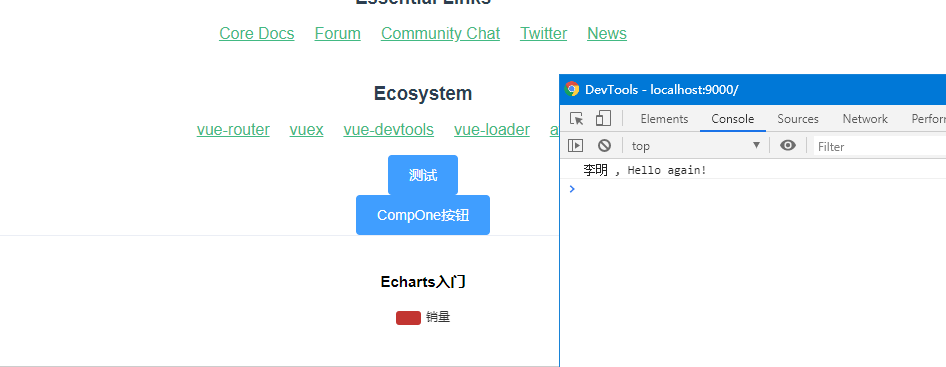

### 5. 添加axios组件库

[Axios](https://github.com/axios/axios)，基于 Promise 的 HTTP 客户端，可以工作于浏览器中，也可以在 node.js 中使用。

功能：

- 从浏览器中创建 XMLHttpRequest
- 从 node.js 中创建 http 请求
- 支持 Promise API
- 拦截请求和响应
- 转换请求和响应数据
- 取消请求
- 自动转换 JSON 数据
- 客户端支持防止 XSRF 攻击

示例代码：

* 执行一个 GET 请求

```javascript
// Make a request for a user with a given ID
axios.get('/user?ID=12345')
  .then(function (response) {
    console.log(response);
  })
  .catch(function (error) {
    console.log(error);
  });
// Optionally the request above could also be done as
axios.get('/user', {
    params: {
      ID: 12345
    }
  })
  .then(function (response) {
    console.log(response);
  })
  .catch(function (error) {
    console.log(error);
  });
```

* 执行一个 POST 请求

```javascript
axios.post('/user', {
    firstName: 'Fred',
    lastName: 'Flintstone'
  })
  .then(function (response) {
    console.log(response);
  })
  .catch(function (error) {
    console.log(error);
  });
```

* 执行多个并发请求

```javascript
function getUserAccount() {
  return axios.get('/user/12345');
}
function getUserPermissions() {
  return axios.get('/user/12345/permissions');
}
axios.all([getUserAccount(), getUserPermissions()])
  .then(axios.spread(function (acct, perms) {
    // Both requests are now complete
  }));
```

### 6. 练习

*  利用axios从服务端请求数据，并用Echarts创建一个时间趋势图表。

* 从服务端请求数据，利用ElementUI中的table组件创建一个表格。

### 附录：

示例代码github地址：[https://github.com/bold881/vuet1.git](https://github.com/bold881/vuet1.git)